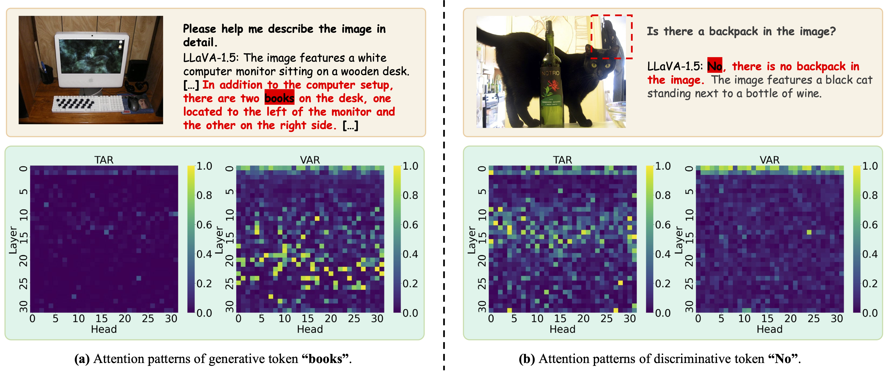
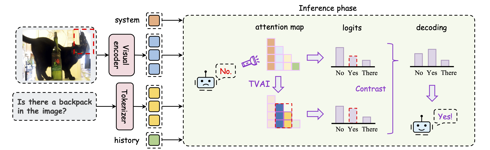
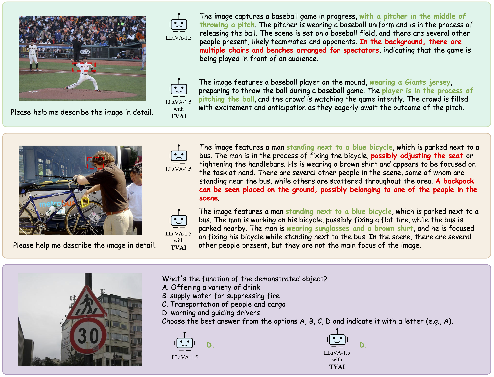

# Modality Bias in LVLMs: Analyzing and Mitigating Object Hallucination via Attention Lens

[](https://arxiv.org/abs/2508.02419)
[](https://opensource.org/licenses/MIT)

> [**Modality Bias in LVLMs: Analyzing and Mitigating Object Hallucination via Attention Lens**](https://arxiv.org/abs/2508.02419)  
> Haohan Zheng<sup>1,\*</sup>, Zhenguo Zhang<sup>2,\*</sup> <br>
> <sup>\*</sup>Equal contribution <br>
> <sup>1</sup>Tsinghua University, <sup>2</sup>ShanghaiTech University
<!-- > AAAI 2026 -->


## 🌟 Motivation
Large vision-language models (LVLMs) have demonstrated remarkable multimodal comprehension and reasoning capabilities, but they still suffer from severe object hallucination. Through an in-depth investigation of the hallucinated mechanisms, we empirically reveal a previously overlooked behavior, termed as modality bias, which indicates that LVLMs struggle to simultaneously attend to both textual and visual modalities, leading to fragmented understanding of user-provided instructions. Based on this observation, we propose a simple yet effective training-free method to mitigate object hallucination. Furthermore, we adopt a contrastive decoding strategy to reduce the LVLM's overreliance on its parametric knowledge, synergistically enhancing our attention manipulation.   

<p align="center">
    <!-- width control -->
</p>

<p align="center">Modality bias in LVLMs.</p>  
<!-- fig title -->


## 🌻 TVAI Framework
The TVAI framework adjusts visual-textual token attention weights to balance cross-modal compatibility and align with user intentions, while integrating contrastive decoding to reduce LVLMs’ overreliance on parametric knowledge and synergistically enhance attention manipulation.

$$ \mathbf{A}^{\prime}_ {l, h}(k,i) = \mathbf{A}_ {l, h}(k,i) + \alpha | \mathbf{A}_ {l, h}(k,i) |, i = t_1 \sim t_{n_T} $$

$$ \mathbf{A}^{\prime}_ {l, h}(k,j) = \mathbf{A}_ {l, h}(k,j) + \beta | \mathbf{A}_ {l, h}(k,j) |, j=v_1 \sim v_{n_V} $$

$$ p_{final}=\gamma \cdot p^\prime(y_k|y_{<k}) + (1 - \gamma) \cdot p(y_k|y_{<k}) $$

<p align="center">
    <!-- width control -->
</p>

<p align="center">Overview of TVAI.</p>  
<!-- fig title -->


## 🕹️ Environment Setup
```
conda env create -f environment.yml
conda activate tvai
```


## 🛠️ Preparation
- Data Download: [COCO(CHAIR and POPE)](https://cocodataset.org/#download), [MMBench](https://huggingface.co/datasets/lmms-lab/MMBench)
  ```bash
  # No additional processing is required for CHAIR and POPE

  cd /path/to/TVAI
  
  # MMBench
  python mmbench_dataset/preprocess.py --data_path /path/to/mmbench
  ```

- Model Download: [LLaVA-1.5](https://huggingface.co/liuhaotian/llava-v1.5-7b), [Qwen-VL-Chat](https://huggingface.co/Qwen/Qwen-VL-Chat), [MiniGPT-4](https://huggingface.co/Vision-CAIR/MiniGPT-4), [Shikra](https://huggingface.co/HuggingSara/shikra-7b-v1-0708-merged).  
Please refer to the configuration section in `model_loader.py` (lines 401-437).


## 🎯 Inference with TVAI
```bash
cd /path/to/TVAI

# CHAIR
python chair_infe.py --model llava-1.5 --data-path /path/to/coco/val2014 --use_instruction_attn --use_img_attn --use_contrast

# POPE
python pope_infe.py --model llava-1.5 --data-path /path/to/coco/val2014 --pope-type adversarial --use_instruction_attn --use_img_attn --use_contrast

# MMBench
python mmbench_infe.py --model llava-1.5 --data-path /path/to/mmbench_dataset/en --use_img_attn --use_instruction_attn --use_contrast
```


## 🔍 Evaluation
```bash
cd /path/to/TVAI

# CHAIR
python chair_eval.py --ans_file chair/llava-1.5/chair_eval_tokens_512_instruction_0.93_5_20_img_0.5_10_30_contrast_1.1_penalty_4.jsonl

# POPE
python pope_eval.py --model llava-1.5 --ans_file pope_coco/llava-1.5/pope_eval_adversarial_tokens_512_instruction_0.93_5_20_img_0.5_10_30_contrast_1.2_penalty_4.jsonl

# MMBench
python mmbench_eval.py --ans_file mmbench/llava-1.5/en/mmbench_eval_en_tokens_512_img_0.5_10_30_instruction_0.5_5_20_contrast_1.1_penalty_4.jsonl
```


## 🎨 Visualization

<p align="center">
    <!-- width control -->
</p>

<p align="center">Some cases of LLaVA-1.5 with and without TVAI.</p>


## 🌈 Citation
If you find this work useful for your research, please cite [our paper](https://arxiv.org/abs/2508.02419).
<!-- ```
``` -->


## 💜 Acknowledgement
Our code implementation is built upon several public repositories [PAI](https://github.com/LALBJ/PAI), [LLaVA-1.5](https://github.com/haotian-liu/LLaVA), [Qwen-VL](https://github.com/QwenLM/Qwen-VL), [MiniGPT-4](https://github.com/Vision-CAIR/MiniGPT-4), [Shikra](https://github.com/shikras/shikra). Thanks for their impressive works!

